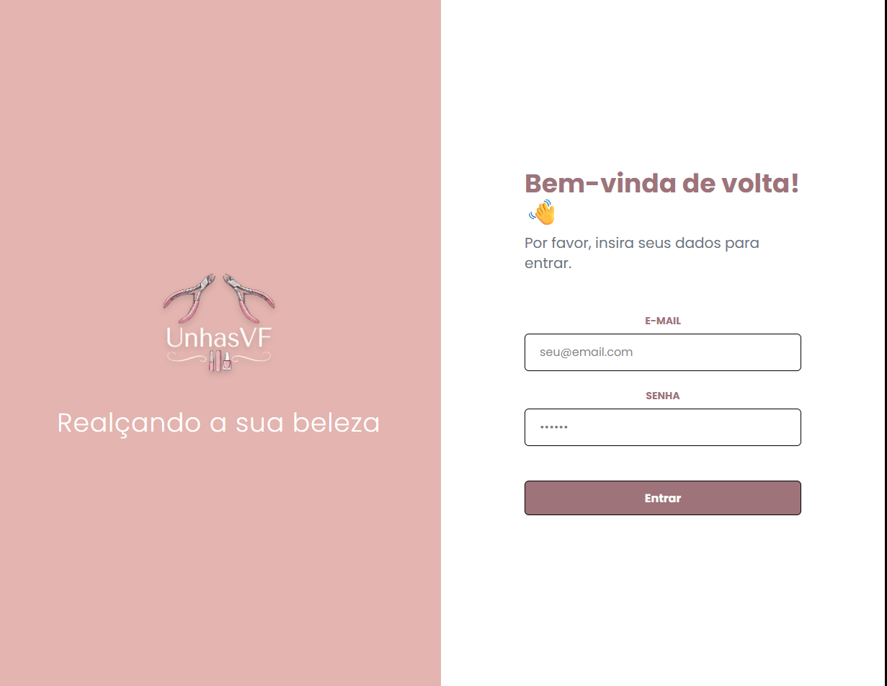
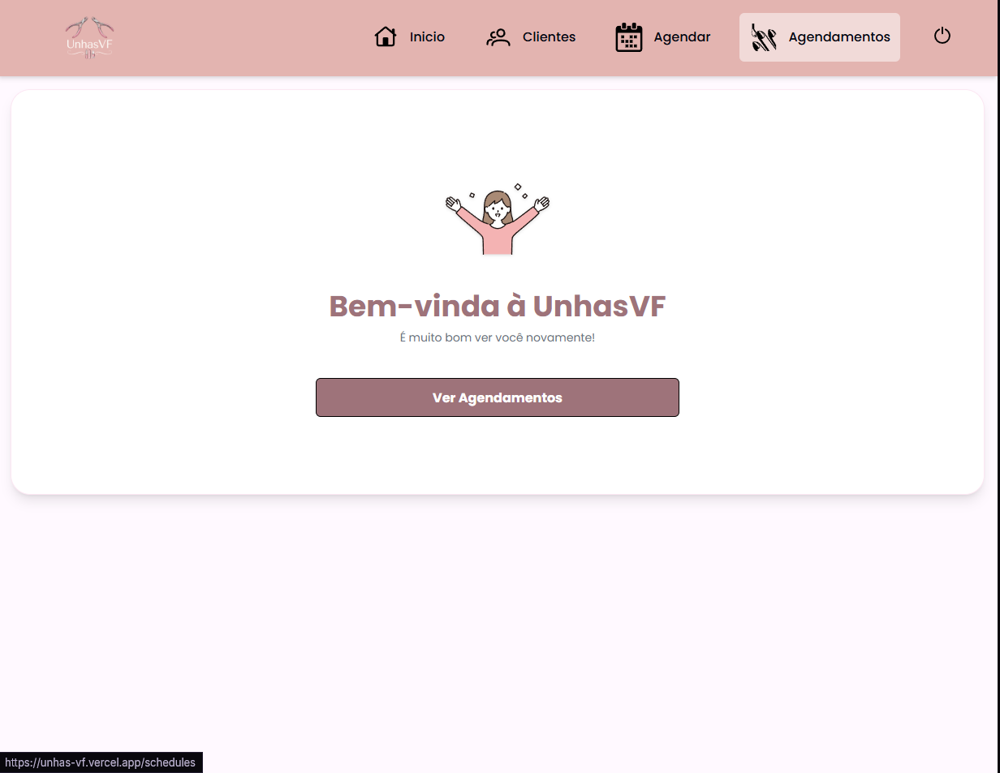
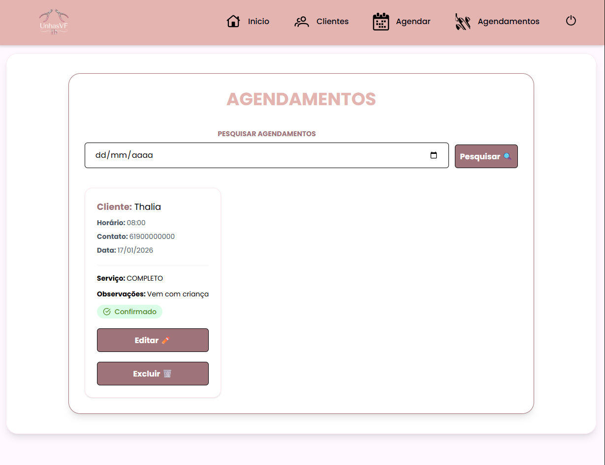
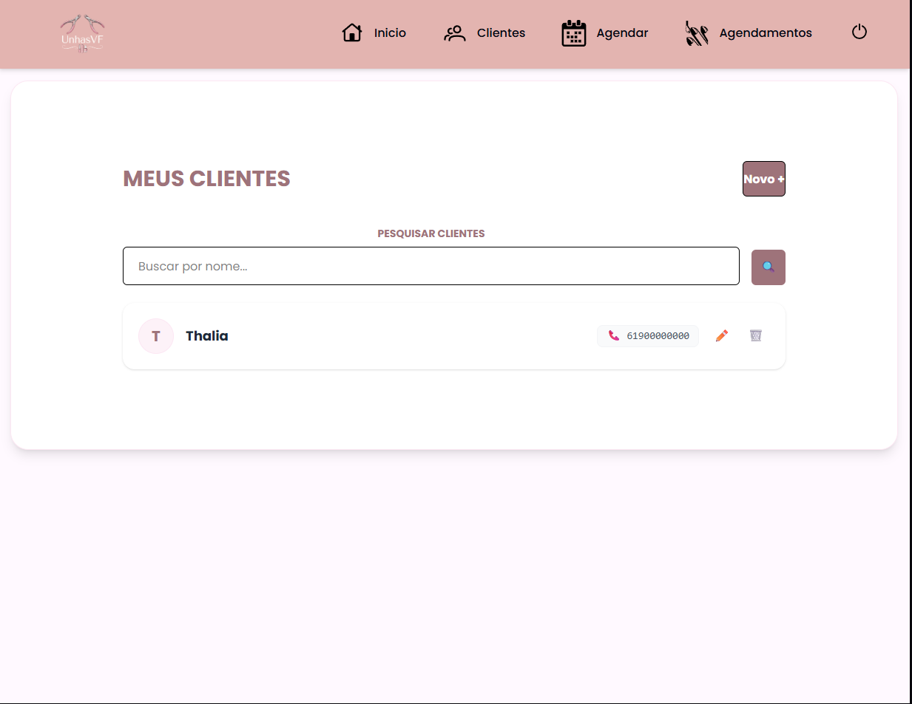
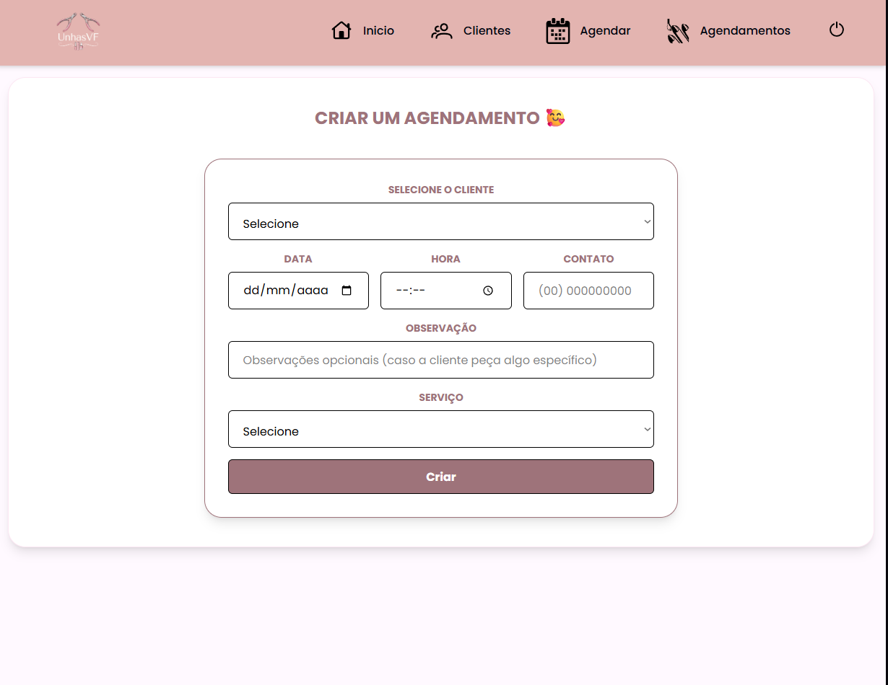
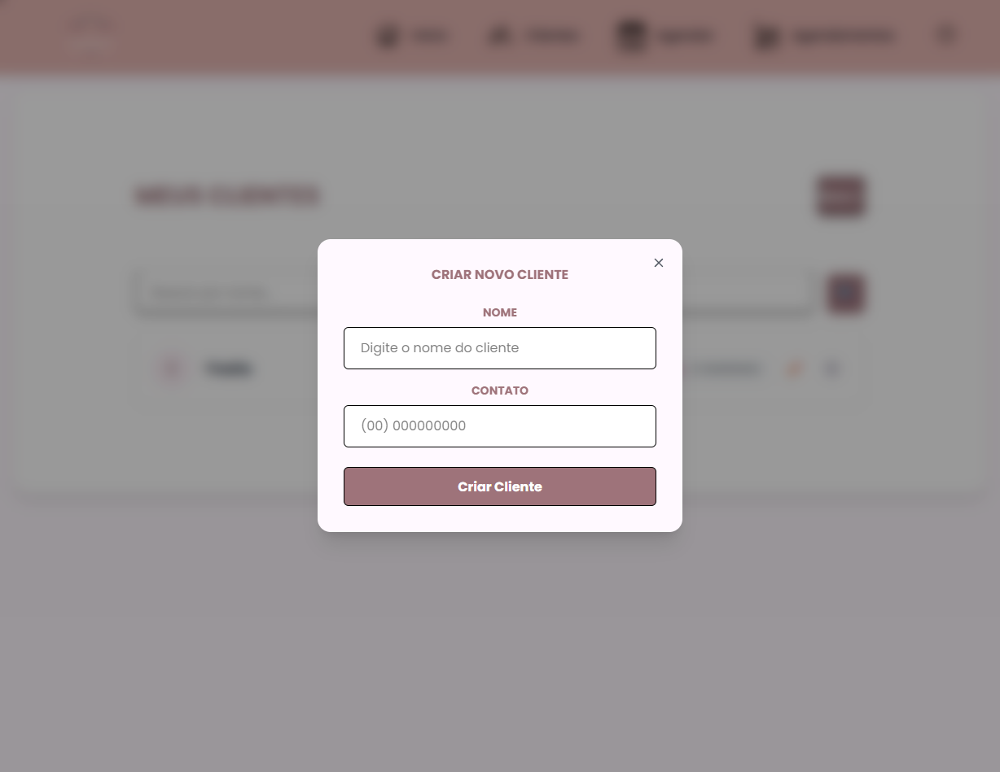

# 💅 Unhas VF — Sistema de Agendamentos

Aplicação web desenvolvida para **controle de agendamentos e clientes**, criada para **uso real em um pequeno negócio** da área de estética.

O sistema foi pensado para facilitar o dia a dia no atendimento, permitindo visualizar, criar e gerenciar agendamentos de forma simples, rápida e organizada.

> 📌 Projeto desenvolvido para uso da minha esposa, atendendo uma necessidade real de organização de agenda.

---

## 🌐 Projeto em produção

🔗 Front-end: https://unhas-vf.vercel.app
🔗 Back-end (API): https://unhasvf-api.onrender.com

---

## 🚀 Tecnologias Utilizadas

### 🎨 Front-end

- **React** (Vite)
- **TypeScript**
- **Tailwind CSS** — Estilização e responsividade
- **React Router DOM** — Navegação entre páginas
- **Axios** — Comunicação com a API
- **SVG** — Ícones e assets visuais

### 🔧 Back-end (API)

- **Node.js**
- **Express**
- **Prisma ORM**
- **PostgreSQL**
- **Zod**
- **JWT (Autenticação)**

> 📎 O backend está disponível em um repositório separado.

---

## ✨ Funcionalidades

### 🔐 Autenticação

- Login seguro com JWT
- Rotas protegidas

### 📅 Agendamentos

- Listagem visual e responsiva
- Criação de agendamento com **data e hora unificadas**
- Edição e exclusão de agendamentos
- Controle de status (Pendente, Confirmado, Cancelado, Encerrado)

### 👥 Clientes

- Listagem de clientes
- Busca por nome
- Cadastro de novo cliente (Modal)
- Edição de dados
- Exclusão de cliente

---

## 📱 Responsividade

O sistema foi desenvolvido com foco em:

- Desktop
- Tablets
- Smartphones

Garantindo boa experiência em diferentes tamanhos de tela.

## 📸 Screenshots do Sistema

Abaixo algumas telas do sistema em funcionamento, demonstrando a experiência real de uso.

---

### 🔐 Tela de Login

  

### Tela de Inicial 🏠

  

### 📅 Agendamentos

  

### 👥 Clientes

  

### ➕ 📅 Novo Agendamento

  

### ➕ 👥 Novo Cliente

  

---
